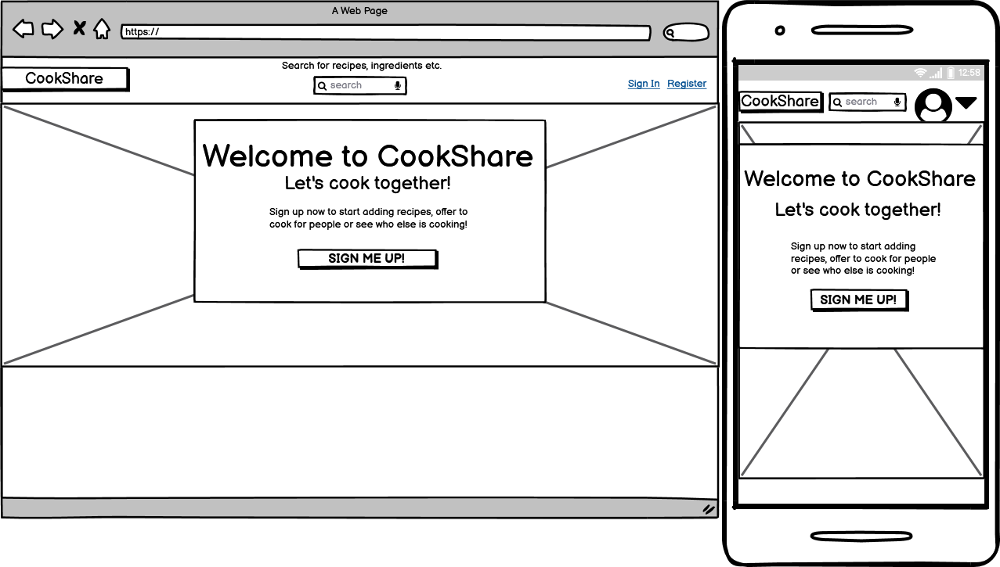
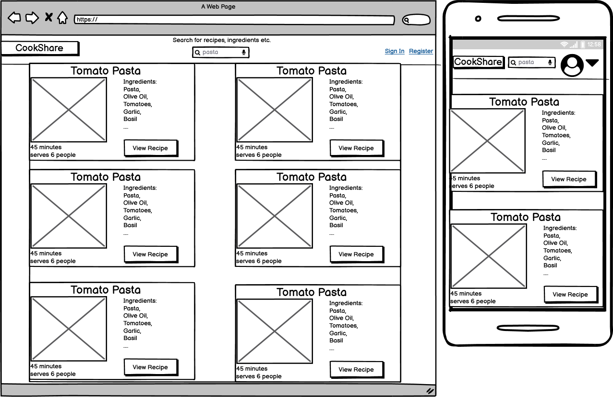

# We Cook - Recipe and community cooking website
This is a website where users can add recipes or search for recipes other users have added.

[Link to live project](https://we-cook-recipe-sharing.herokuapp.com/)

---

### User Stories:
 - New visitors want to easily find out what or who the site is for.
 - New visitors want to easily navigate the website.
 - Visitors want to register for the website.
 - Users want to easily add their own recipes.
 - Users want to find others' recipes.

### Features:
- Responsive and user friendly interface.
- Easy navigation menu.
- Intuitive search feature.
- Simple and intuitive forms.
- Informative form validation feedback.
- Users can easily add or edit recipes.
- Users can edit their profile.

### Structure:
 - All pages will have a top navigation bar.
 - Main content will be centered horizontally and vertically.
 - Search results will be displayed in a grid of recipe cards.
 - Profile pages will feature that users' recipes.
 - Dedicated page for each recipe to allow bookmarking of recipes.

### Skeleton:
###### Wireframes:
__Home Page__ 
__Profile Page__ 
__Search Page__ 

### Surface:
 - I chose a simple color pallete featuring tones that resemble natural food colors.
 - I used intuitive colors for call to action buttons and form buttons.
 - I used the Material Design Bootstrap CSS framework which includes Roboto as a default font and implements material design button effects. This helps to make the site intuitive and user friendly.

### Database Planning:

The database will contain 2 collections: Users and Recipes.

[Link to database schema](DATABASE.MD)
 - 

### Features to implement:
 - Email verification
 - cook sharing feature:
   - users can offer to cook or accept other users' offers.
   - offers are based on location and users can view them on a map.
 - recipe favourites:
   - users can save recipes to their favourites collection
   - users can view other users' favourites.
 - add pagination if there are more than 10 recipes in search results or on a profile page

### Testing

Details of testing can be found [here](TESTING.MD)

### Technologies Used:

#### Languages

- HTML
- CSS
- Javascript
- Python

#### Libraries, Frameworks etc.
- [Flask](https://flask.palletsprojects.com/en/1.1.x/) framework was used to build the web application.
- [MongoDB](https://www.mongodb.com/) was used for the database.
- [Flask-PyMongo](https://flask-pymongo.readthedocs.io/en/latest/) was used to access MongoDB from flask.
- [Werkzeug](https://werkzeug.palletsprojects.com/en/1.0.x/) was used to hash passwords and secure filenames.
- [WTForms](https://wtforms.readthedocs.io/en/2.3.x/) and [Flask-WTforms](https://flask-wtf.readthedocs.io/en/stable/) were used for server-side form validation.
- [MDBootstrap](https://mdbootstrap.com/) was for styling, layout and typography.
- [GitHub](https://github.com/) was used for version control.
- [Heroku](https://www.heroku.com/) was used for deployment.

### Issues:
 - ##### Dynamic number of input fields and WTForms validation:
   - For the recipe form I want the user to be able to dyncamically add and remove ingredients while still being able to validate the input with WTForms. I adapted the code found in [this guide](https://www.rmedgar.com/blog/dynamic-fields-flask-wtf/) to render inputs with the correct attributes to allow for WTForms validation.
 - ##### 413 error handling:
  - When a user uploads a file that is larger than the limit set in flask (MAX_CONTENT_LENGTH), the connection is aborted before the error is handled properly. The browser displays a default "ERR_CONNECTION_ABORTED" message. This is the case with a local werkzeug development server, with debug on or off and also when deployed to heroku using gunicorn in production mode.
  - Solution: I couldn't find a way to get the server to handle the 413 and redirect instead of showing the default browser error page so I decided to validate the file size and extension in Javascript. I added an event listener to the file input which would display an error and disable the form submit button if the user selected a file over 2MB or a file that didn't have a .jpg, .jpeg or .png extension.

### Deployment

This project was deployed to Heroku with the following steps:

1. Ensure your app has debug mode set to False when deploying.
2. Add a file called `Procfile` with no extension to your project directory and add `web: python app.py`
3. Heroku can install dependencies from a requirements.txt or a Pipfile
   - To create a requirements.txt run `pip freeze > requirements.txt`
   - To create a Pipfile run `pip install pipenv`, `pipenv install`
4. Create an account on Heroku and create a new app.
5. In your app dashboard, in the deploy section, select 'Connect to GitHub'
6. Select the GitHub repository that contains your project.
7. Select Automatic deploys and choose your desired branch.
8. Go to the app settings on Heroku and click 'Reveal Config Vars'
9. Add the required keys as they are in your local env.py (i.e IP, PORT, SECRET_KEY, MONGO_URI, MONGO_DBNAME)
10. Go to the app Overview page and when the build is finished, click 'Open App'

### Credits

#### Images
 - The home page background, recipe images and profile pictures were all taken from [Unsplash](https://unsplash.com/)

#### Code
 - The code in dynamicForm.js which allows users to add/remove inputs and validate them with WTForms was taken from [this guide](https://www.rmedgar.com/blog/dynamic-fields-flask-wtf/)
 - I followed [this tutorial series](https://www.youtube.com/watch?v=vzaXBm-ZVOQ) to learn how to use Flask-WTF and WTForms
 - I followed [this tutorial](https://www.youtube.com/watch?v=DsgAuceHha4) to learn how to save and retrieve files with Flask and MongoDB

### Acknowledgements
 - I received great advice and feedback from my mentor Brian Macharia and from the Code Institute Slack community.